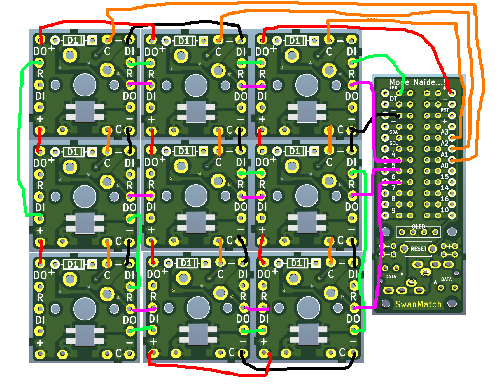

# Cherry-Mx-LED-Bitboard

https://raw.githubusercontent.com/ogatatsu/Cherry-Mx-Bitboardを改変し、  
helixを参考にSK6812miniがハマるようにしたものです。

自作キーボード用のプリント基板、１つの基盤が１個のスイッチに対応しています。

この基板を使うと、基板設計をしなくてもオリジナル配列のフルカラーバックライトのキーボードが作れます。

たとえばこんなキーボードを組むことができます。

詳しくはこちら。

http://swan-match.hatenablog.com/entry/2018/09/15/184923

## 材料例(仕入先)

* 任意にカットしたプレート  
  * 2mmアクリル板(遊舎工房さん)  
    3mmアクリル角材と接着剤があるとよい。(ホームセンター)
  * 3Dケース(DMM.make)
  * 5mmダンボール(そのへんから拾ってくるなど。)
* ダイオード(TALPKeyboardさん)
* SK6812mini(遊舎工房さん)
* ウレタンエナメル線(ホームセンター。ジャンパー線でも可能ですが。。。)
* TRRSジャック、RESETボタン(秋月電子さん)
* OLED(オプション、遊舎工房さん)
* Promicro(遊舎工房さん、TALPkeyboardさん)
* 各種スペーサー、ネジ(廣杉計器、Aliexplessなど)
* キースイッチ、キーキャップ(お好みに応じて)
* USBケーブル、TRS(3.5mm3極)ケーブル

その他に温度調節はんだごて、テスター、ピンセットなどの道具が必要です。

## 組立例

### Bitboard(無限の可能性)

Bitboardのピン配置は以下の通りです。

* Ｃ: 横線(Col)
* Ｒ: 縦線(Row)
* DI: LED制御信号入力(DataIn)
* DO: LED制御信号出力(DataOUT)
* －: グランド(LED用)
* ＋: VCC(LED用5V)

* ダイオードをはんだ付けします。
* SK6812miniをはんだ付けします。  
  温度調節はんだごてで220℃くらいではんだ付けしてください。  
  もたもたしていると壊れます。
  ウレタンエナメル線を使う場合は表面皮膜を溶かそうとコテを当てすぎるとチップが壊れてしまう場合があります。  
  はんだ付けに自信がない方は最後に実装するようにしてください。
* トッププレートにスイッチをはめて、裏にBitboardをはめてスイッチの足をはんだ付けします。  
  このとき2mmアクリル板を使う場合は、スイッチが抜けてしまうのを防ぐため、  
  プレート裏面のスイッチ脇に3mmアクリル角材をアクリル接着剤などでくっつけておくことを強くおすすめします。
* 自身の組みたいキーボードのキーマトリックスに合わせ、横線と縦線を配線します。  
  中島みゆきさんの「糸」を聞きながら作業するといいです。
* 全ての「－」と「＋」をつなげる。
* LEDの光らせたい順番にDIからDOに配線していきます。
  一個目DO→二個目DI→二個目DO→三個目DI…

### ProMicroSocket

* TRRSJACKとRESETスイッチをはんだ付けします。
* OLEDソケットをはんだ付けします。
* 任意のピンの横の穴から縦線と横線、LED信号線、グランド、VCCを、それぞれBitBoardに対して配線します。
* Promicroをソケットにはんだ付けします。  
  (スプリングピンソケットを使ってもいいですが、もげたらソケットごと交換したほうが安上がり。)

### 配線例

例えば3*3の格子配列だったら以下のような配線になります。  
LEDは右上から螺旋状に配線しています。

### 仕上げ

お好みに合わせてQMKFirmwareを書き込んで、  
あなただけのオリジナルキーボードの完成です。

### 終わりに

この基板を使ってキーボードを組んだ際にはぜひ@swan_matchまでご一報ください。

あなたのEndGameを応援しています！！

## Licence

https://creativecommons.org/licenses/by/4.0/
